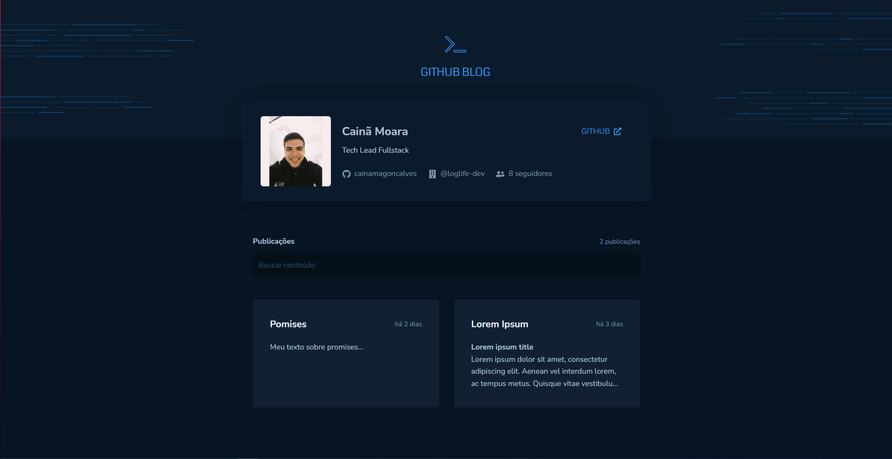
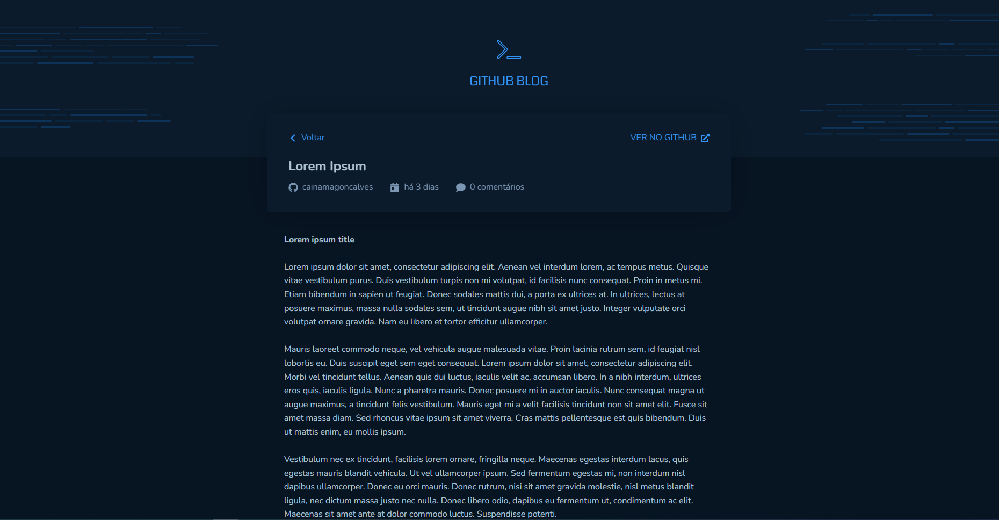

<h1 align="center">
  <a href="https://github-blog-8c7bu610k-cainamagoncalves.vercel.app" target="_blank">
  Github Blog
  </a>
</h1>

<p align="center">🧾 Project to show github issues as posts</p>

<p align="center">
  

  
</p>

<p align="center">
 <a href="#About">About</a> • 
 <a href="#Requisites">Requisites</a> •
 <a href="#Running the project">Running the project</a> • 
 <a href="#Technologies">Technologies</a> • 
 <a href="#Author">Author</a>
</p>

<h4 align="center">✔ Github-blog - Primary version finished published on vercel (click on the title)</h4>

---

##### All posts view and search page
<h1 align="center">
  
</h1>

##### Post view page
<h1 align="center">
  
</h1>


### About

This project is an method to pratice the learning from the rocketseat ignite course. I'm used concepts like state controll, context api, styles with styled-components, properties share, navigation between components with react-router conceps about requests with axios and others.

### Requisites

Before you run this application, you will need to had on your computer: [Git](https://git-scm.com), [Node.js](https://nodejs.org/en/). It´s recommended you have some text editor installed as [VSCode](https://code.visualstudio.com/).

### Running the project

```
# Clone this repo with the command
$ git clone <https://github.com/cainamagoncalves/github-project>

# Run cmd and access the project folder
$ cd github-blog

# Install the dependencies
$ npm install

# Run the project
$ npm run dev
```

### Technologies

The tools used to build this project are:

- [React](https://pt-br.reactjs.org)
- [Typescript](https://www.typescriptlang.org)
- [Vite](https://vitejs.dev)
- [Axios](https://www.npmjs.com/package/axios)
- [React hook form](https://react-hook-form.com)
- [Styled components](https://styled-components.com)

### Author

---

 
 <br />

It was did with ❤️ by Cainã Gonçalves 👋🏽 contact me!

[](https://www.linkedin.com/in/cainã-gonçalves/) 
[](mailto:moaraadrean@gmail.com)


